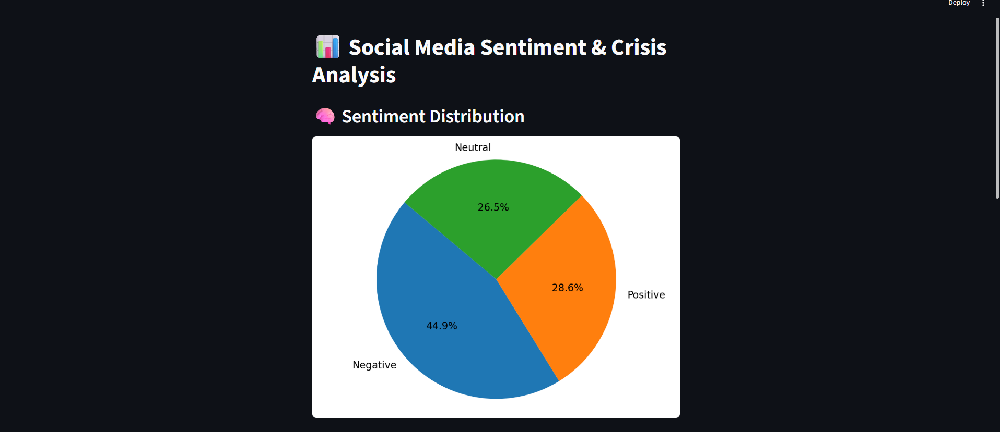
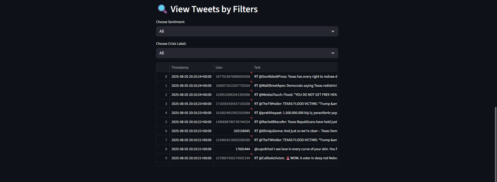

# 🌐 Social Media Sentiment & Crisis Detection Dashboard

This project analyzes tweets to understand public sentiment and detect potential crisis-related content. It uses Natural Language Processing (NLP), sentiment scoring, and visualizes the results using a Streamlit dashboard.

---

## ✅ Features

- Fetch tweets from Twitter using keywords
- Clean and preprocess tweet text
- Perform sentiment analysis (Positive, Neutral, Negative)
- Detect crisis-related tweets based on keywords
- Visualize sentiment and crisis distribution using charts
- Display interactive dashboard using Streamlit

---

## 📁 Project Structure

social_media_crisis_project/
│
├── analysis/
│   ├── fetch_tweets.py
│   ├── clean_tweets.py
│   ├── sentiment_analysis.py
│   └── crisis_detector.py
│
├── data/
│   ├── tweets_raw.csv
│   ├── tweets_clean.csv
│   ├── tweets_sentiment.csv
│   └── tweets_crisis.csv
│
├── visualization/
│   ├── plot_sentiment.py
│   ├── plot_crisis.py
│   ├── sentiment_plot.png
│   └── crisis_pie_chart.png
│
├── main.py
├── config.py
└── README.md


---

## 🔧 Setup Instructions

### 1. Clone the Repository

git clone https://github.com/akshitasankhwar/social-media-sentiment-crisis-analysis.git

cd social-media-sentiment-crisis-analysis


### 2. Install Required Libraries

pip install pandas nltk tweepy matplotlib streamlit


### 3. Configure Twitter API

Create or edit the `config.py` file and add your credentials:

```python```
API_KEY = "your_api_key"

API_SECRET = "your_api_secret"

ACCESS_TOKEN = "your_access_token"

ACCESS_TOKEN_SECRET = "your_access_token_secret"

BEARER_TOKEN = "your_bearer_token" 

🚀 How to Run

Step 1: Fetch Tweets

python analysis/fetch_tweets.py

Step 2: Clean Tweets

python analysis/clean_tweets.py

Step 3: Sentiment Analysis

python analysis/sentiment_analysis.py

Step 4: Crisis Detection

python analysis/crisis_detector.py

Step 5: Run the Streamlit Dashboard

streamlit run main.py


## 📊 Dashboard Preview


### 1. Sentiment Analysis Plot


### 2. Crisis Pie Chart


### 3. Streamlit Dashboard



🧠 Future Improvements

Add support for more platforms like Reddit or Instagram

Enable real-time streaming analysis

Improve crisis detection with machine learning

Add trend analysis over time


👩‍💻 Author

Akshita Sankhwar

B.Tech Student | Social Media Data Analyst

Contact: akshitasannkhwar24@gmail.com


📜 License


This project is for educational purposes.


---

#### 📌 4. Save the File

- Press `Ctrl + S` (or click **File > Save**).

---

#### 📌 5. Preview Your README (Optional)

If you want to see how it looks:

- Right-click anywhere in `README.md`.
- 
- Click **“Open Preview”** or press `Ctrl + Shift + V`.

---

If you still face issues, I can help via screenshot or video explanation too — just let me know!


